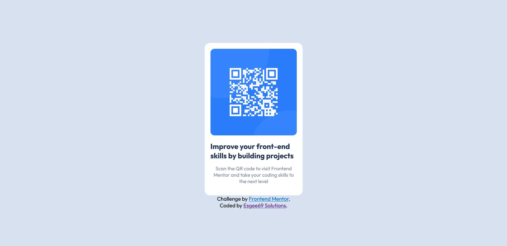

# Frontend Mentor - QR code component solution

This is a solution to the [QR code component challenge on Frontend Mentor](https://www.frontendmentor.io/challenges/qr-code-component-iux_sIO_H). Frontend Mentor challenges help you improve your coding skills by building realistic projects. 

## Table of contents

- [Overview](#overview)
  - [Screenshot](#screenshot)
  - [Links](#links)
- [My process](#my-process)
  - [Built with](#built-with)
- [Author](#author)

## Overview
A Frontend Mentor project to recreate a given design of a QR code graphic with only CSS and HTML.
### Screenshot
- Desktop View
   

- Mobile View
   

### Links

- Live Site URL: [Github Pages](https://paresh2421.github.io/qr-code-component-main/)

## My process
It is a simple page which needed basic css and html.

### Built with

- HTML5 
- CSS
- Flexbox

## Author

- Github - [My Github](https://github.com/Paresh2421)
- LinkedIn - [My LinkedIn](https://www.linkedin.com/in/paresh-nair-1987b4254)